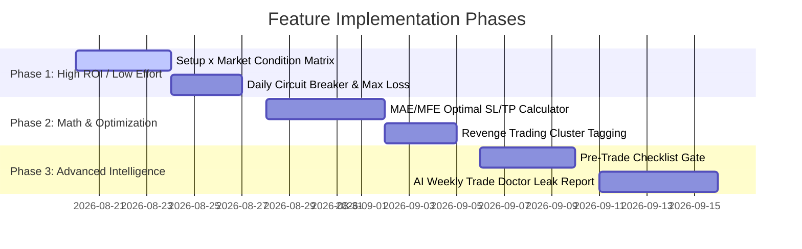

# Trader Decision-Making & Edge Optimization Blueprint

## Executive Overview
A trading journal's ultimate purpose is not merely logging past transactions, but actively transforming trader behavior and refining mathematical edge. 

By leveraging existing journal data (Executions, MAE/MFE, Setups, Triggers, Confluences, Market Conditions, Sessions, and Emotions), this blueprint outlines high-impact features designed to **prevent catastrophic capital leaks** and **maximize systematic execution**.

---

## 1. Pillar 1: Pre-Trade & Risk Guardrails (Preventing Costly Mistakes)

### 1.1 Daily Circuit Breaker & Tilt Lockout
* **Problem**: 80%+ of account blowups occur during sudden emotional spirals following consecutive losses, where traders increase lot sizes or rapidly overtrade.
* **Mechanism**:
  * User configures a custom **Daily Maximum Drawdown** (e.g., `-3.0R` or `-$300` or `-3%` of account balance).
  * Real-time calculation aggregates closed + open trades for the current calendar day (in user's broker timezone).
  * Once the threshold is breached, the UI presents an unmissable **Circuit Breaker Modal / Lockout Banner**:
    * Displays exact loss incurred today.
    * Highlights psychological cooldown countdown (e.g., "Trading locked until Asian Session opens tomorrow").
    * Prompts the user with post-loss grounding exercises.
* **Data Requirements**:
  * Account settings field: `daily_max_loss_r`, `daily_max_loss_usd`, `daily_max_loss_pct`, `enforce_circuit_breaker: boolean`.

---

### 1.2 15-Second Pre-Trade Checklist Gate
* **Problem**: Impulsive entries taken without verifying strategy rules account for the majority of unforced errors.
* **Mechanism**:
  * When opening a manual trade or clicking "Review Pending Trade", a streamlined 4-point checklist is presented:
    1. 🎯 *Is this trade aligned with the Higher Timeframe Bias (`HTF Bias`)?*
    2. 🛡️ *Is risk strictly defined and within the 1-2% position sizing rule?*
    3. ⚖️ *Is the minimum expected Risk-to-Reward ratio at least 1:1.5?*
    4. 📰 *Are there any high-impact economic news events (Red Folders) within the next 30 minutes?*
  * Trades store a `checklist_compliance_score` (0% to 100%).
  * Analytics correlates and proves to the trader: *"Trades with 100% checklist compliance have a +64% win-rate vs 31% on non-compliant trades."*

---

### 1.3 High-Impact Economic News Overlay
* **Problem**: Entering trades right before CPI, FOMC, NFP, or rate decisions results in slippage, spread expansion, and erratic stop-outs.
* **Mechanism**:
  * Integration with economic calendar feed (ForexFactory / TradingEconomics).
  * Auto-tags trades taken within ±30 minutes of high-impact releases for the traded currency/asset.
  * Filters and analyzes: *"P&L during Red-Folder News vs P&L during Normal Market Hours."*

---

## 2. Pillar 2: Edge & Statistical Intelligence (Knowing What Actually Works)

### 2.1 Setup × Market Condition × Session Edge Matrix
* **Problem**: Traders often know their favorite setups, but fail to realize that certain setups only work in specific market regimes.
* **Mechanism**:
  * Multi-dimensional matrix cross-referencing:
    * **Setup** (e.g., *Break & Retest*, *Order Block*, *Liquidity Sweep*)
    * **Market Condition** (*Trending*, *Trending Range*, *Sideways*)
    * **Session** (*London*, *New York*, *Asia*, *Overlap*)
  * Calculates Win Rate, Avg R-Multiple, Expectancy, and Total Net PnL for each combination.
  * **Automated Actionable Directives**:
    > 🟢 *"Your **Liquidity Sweep** setup in **Trending** markets generates **+1.85R Expectancy** (74% Win Rate)."*  
    > 🔴 *"Your **Break & Retest** setup in **Sideways / Range-bound** markets loses **-0.65R Expectancy** (23% Win Rate). 👉 Stop trading breakouts in ranges."*

---

### 2.2 MAE/MFE Optimal SL & TP Discovery Engine
* **Problem**: Traders either set Stop Losses too tight (getting wicked out before moves) or take profit too late (giving back profits).
* **Mechanism**:
  * Leverages stored `mae_pips`, `mae_r`, `mfe_pips`, and `mfe_r` data.
  * **Simulated SL Curve**: Simulates trade outcomes if SL were adjusted by ±2, ±5, ±10 pips:
    * *"Widening your SL by 4 pips would have saved 28% of stopped-out winning trades, increasing total profitability by +12.4R."*
  * **Simulated TP / Exit Efficiency Curve**:
    * Identifies the optimal Take-Profit sweet spot (e.g., peak cumulative R achieved at 2.1R before mean reversion kicks in).

---

### 2.3 Trade Duration & Holding Time Decay Curve
* **Problem**: Holding losing trades too long in hopes of breakeven while cutting winning trades prematurely.
* **Mechanism**:
  * Scatter plot and binned decay curves: **Holding Duration (minutes/hours) vs Final Outcome (R-Multiple)**.
  * Uncovers behavioral patterns:
    * *Winners reach target within 45–90 minutes.*
    * *Trades held beyond 3 hours suffer an 82% loss rate.*

---

## 3. Pillar 3: Behavioral & Psychology Diagnostics

### 3.1 Revenge Trading & Clustering Detector
* **Problem**: Rapid re-entries following a loss are almost always emotionally charged and produce the largest negative runs.
* **Mechanism**:
  * Algorithmic detection of "Trade Clusters": Trades opened within 15 minutes of closing a losing trade on the same or correlated symbol.
  * Automatically tags the trade with a `REVENGE_CLUSTER` flag.
  * Dedicated Analytics Card:
    * Total trades in revenge clusters vs Planned trades.
    * Cumulative dollar/R cost of impulsive entries.

---

### 3.2 AI Trade Doctor (Automated Weekly Leak Report)
* **Problem**: Traders get overwhelmed by raw tables and lack time to synthesize multi-variable performance data.
* **Mechanism**:
  * End-of-week AI synthesis (Gemini 2.5/Flash) analyzing the week's trading logs:
    1. **Primary Strength**: What went right (e.g., high discipline during London session).
    2. **Biggest Leak Identified**: The single specific behavior that cost the most money that week.
    3. **Action Rule for Next Week**: One clear, actionable constraint (e.g., *"Zero trades after 18:00 UTC"* or *"Do not trade Gold during Sideways conditions"*).

---

## 4. Prioritized Implementation Roadmap

| Feature | Difficulty | Impact | Primary Benefit |
| :--- | :---: | :---: | :--- |
| **1. Setup × Market Condition Edge Matrix** | 🟢 Low | ⭐️⭐️⭐️⭐️⭐️ | Directly tells the trader what market structures to trade |
| **2. Daily Circuit Breaker / Loss Limit** | 🟢 Low | ⭐️⭐️⭐️⭐️⭐️ | Stops emotional tailspins and account blowups |
| **3. Revenge Trading Cluster Detector** | 🟢 Low | ⭐️⭐️⭐️⭐️ | Quantifies exact cost of impulsive post-loss re-entries |
| **4. MAE/MFE Optimal SL/TP Calculator** | 🟡 Medium | ⭐️⭐️⭐️⭐️⭐️ | Mathematical precision for stop-loss and take-profit targets |
| **5. 15-Sec Pre-Trade Checklist** | 🟢 Low | ⭐️⭐️⭐️⭐️ | Enforces pre-flight discipline on every single execution |
| **6. AI Trade Doctor Weekly Leak Report** | 🟡 Medium | ⭐️⭐️⭐️⭐️ | Personalized automated coaching and focus directives |
